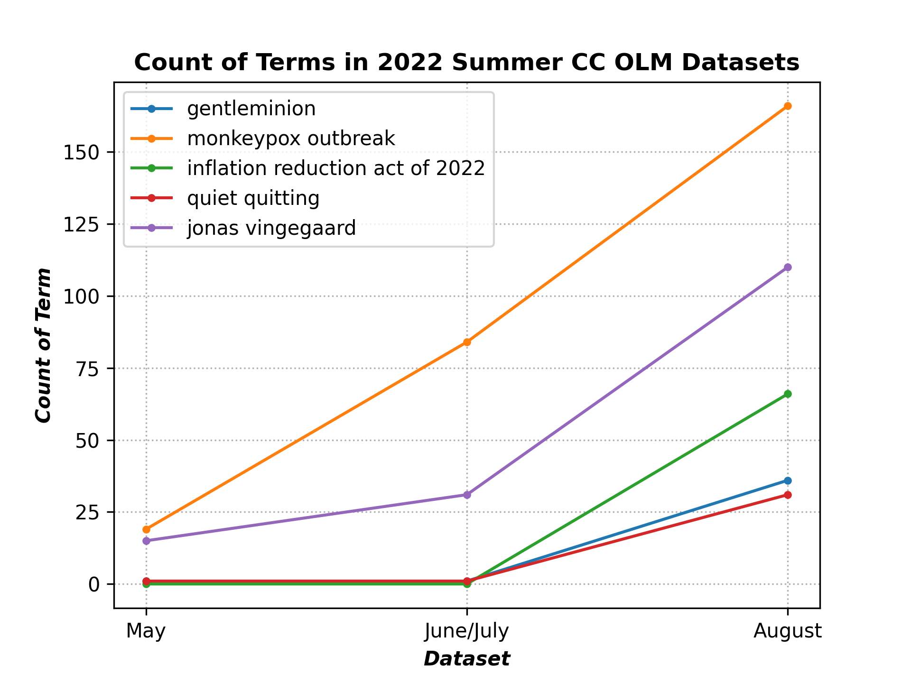
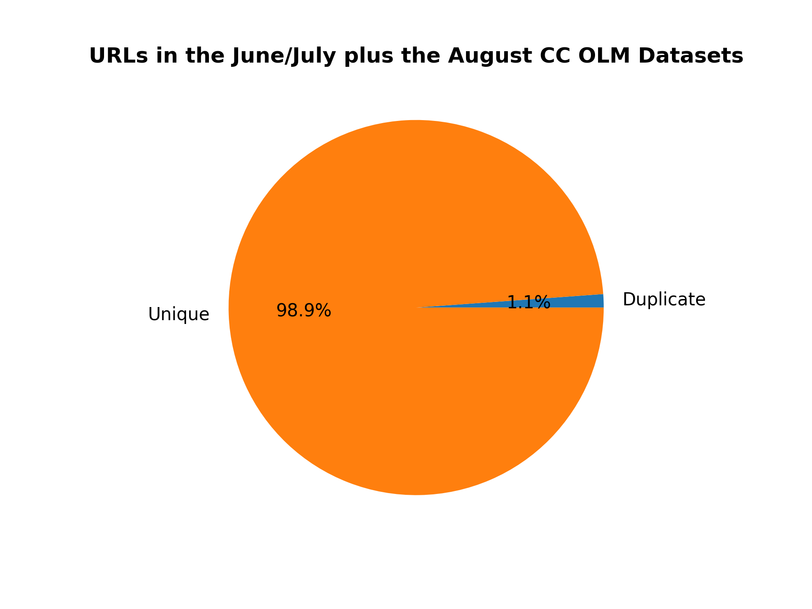

This folder has tools that you can use to get a little information about the OLM datasets, or any Hugging Face dataset for text-pretraining.

## To analyze for term counts accross various datasets

This command reports the count of terms associated with events that happened over summer 2022, accross chronologically ordered summer 2022 OLM datasets. We would expect the counts to go up over the summer:

```
python term_counts.py --input_dataset_names Tristan/olm-CC-MAIN-2022-21-sampling-ratio-0.14775510204 Tristan/olm-CC-MAIN-2022-27-sampling-ratio-0.16142697881 Tristan/olm-CC-MAIN-2022-33-sampling-ratio-0.20 --input_dataset_pretty_names "May" "June/July" "August" --terms "gentleminion" "monkeypox outbreak" "inflation reduction act of 2022" "quiet quitting" "jonas vingegaard" --plot_title="Count of Terms in 2022 Summer CC OLM Datasets" --analysis_column=text --split=train --num_proc=224 --output_filename=summer_2022_term_counts.png --load_from_hub_instead_of_disk
```

Here is the resulting figure:




## To analyze for duplicates accross various datasets

This command reports the ratio of shared URLs between the August and June/July Common Crawl OLM Datasets:

```
python duplicates.py --input_dataset_names Tristan/olm-CC-MAIN-2022-33-sampling-ratio-0.20 Tristan/olm-CC-MAIN-2022-27-sampling-ratio-0.16142697881 --analysis_column=url --split=train --num_proc=224 --plot_title="URLs in the June/July plus the August CC OLM Datasets" --output_filename=duplicate_urls.png --load_from_hub_instead_of_disk
```

Here is the resulting figure:



## Documentation

```
python term_counts.py --help
```

```
python duplicates.py --help
```
